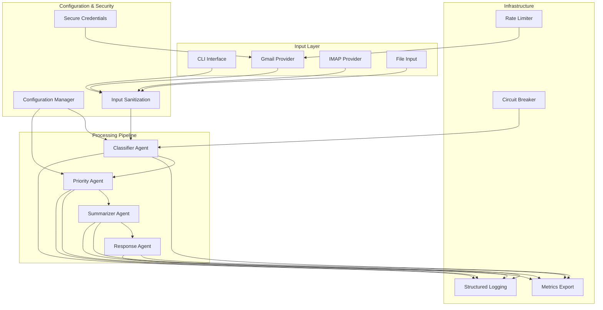
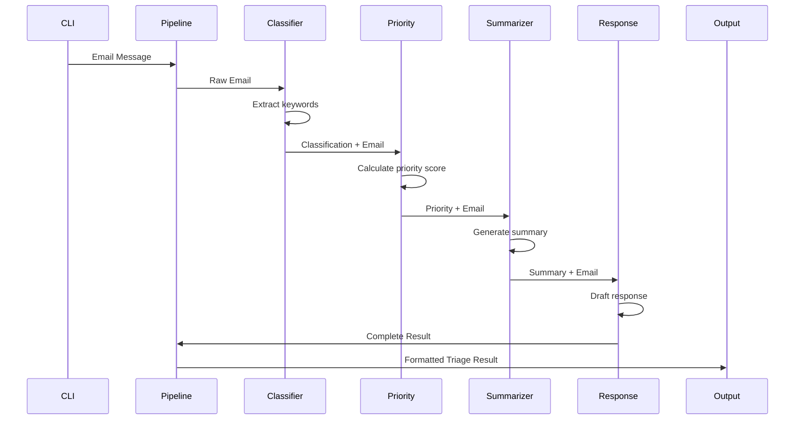

# Architecture

## System Overview

CrewAI Email Triage is a multi-agent email processing system that automatically classifies, prioritizes, summarizes, and generates responses for email messages. Built for busy professionals managing high volumes of email.

## High-Level Architecture



## Core Components

### Agent Pipeline
Each email flows through a sequential pipeline of specialized agents:

1. **ClassifierAgent** - Categorizes emails (urgent, spam, work, etc.)
2. **PriorityAgent** - Assigns priority scores based on keywords and context
3. **SummarizerAgent** - Generates concise summaries of email content
4. **ResponseAgent** - Drafts appropriate replies based on classification

### Processing Modes
- **Single Message**: Process individual emails via CLI
- **Batch Processing**: Handle multiple messages from files
- **Parallel Batch**: Concurrent processing for performance
- **Gmail Integration**: Fetch and process unread messages via IMAP

### Configuration System
- **Default Config**: Ships with `default_config.json`
- **Custom Config**: Override via `--config` flag or `CREWAI_CONFIG` env var
- **Environment Integration**: Secure credential loading from environment

## Data Flow



## Security Architecture

### Input Sanitization
- Content validation and sanitization
- Prevention of injection attacks
- Email header validation

### Credential Management
- Environment variable loading
- Secure storage patterns
- OAuth integration ready

### Security Scanning
- Pre-commit hooks for secret detection
- Dependency vulnerability scanning
- Static code analysis

## Performance Considerations

### Scaling Patterns
- Agent reuse for batch processing
- Parallel processing capabilities
- Circuit breaker for fault tolerance
- Rate limiting for external APIs

### Monitoring & Observability
- Structured logging with request IDs
- Metrics export for monitoring
- Performance benchmarking
- Health check endpoints

## Technology Stack

### Core Dependencies
- **Python 3.8+**: Runtime environment
- **cryptography**: Secure credential handling
- **pytest**: Testing framework

### Development Tools
- **ruff**: Linting and formatting
- **bandit**: Security analysis
- **pre-commit**: Git hooks
- **pytest-xdist**: Parallel testing

## Deployment Architecture

### Local Development
- Virtual environment setup
- Pre-commit hooks
- Local testing suite

### CI/CD Pipeline
- Automated testing
- Security scanning
- Code quality checks
- Parallel execution

### Production Considerations
- Container deployment ready
- Health monitoring
- Metrics collection
- Error tracking

## Extension Points

### Provider Interface
```python
class EmailProvider:
    def fetch_messages(self) -> List[EmailMessage]:
        pass
    
    def send_response(self, message: str) -> bool:
        pass
```

### Agent Interface
```python
class Agent:
    def run(self, email: EmailMessage) -> AgentResult:
        pass
```

### Configuration Schema
```json
{
  "classifier": {
    "categories": ["urgent", "spam", "work"],
    "keywords": {...}
  },
  "priority": {
    "scoring": {...}
  }
}
```

## Quality Attributes

### Reliability
- Circuit breaker patterns
- Graceful degradation
- Error recovery mechanisms

### Performance
- Sub-second processing for single emails
- 100+ emails/minute batch processing
- Memory-efficient agent reuse

### Security
- Input validation and sanitization
- Secure credential handling
- Audit logging

### Maintainability
- Modular agent architecture
- Comprehensive test coverage
- Clear separation of concerns

## Future Enhancements

### Planned Features
- Machine learning model integration
- User feedback loop
- Advanced email providers (Outlook, Exchange)
- Web interface
- API endpoints

### Scalability Roadmap
- Microservice decomposition
- Event-driven architecture
- Distributed processing
- Cloud-native deployment
