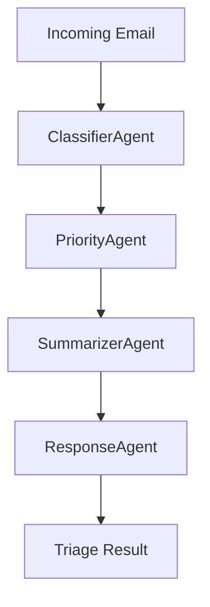

# Architecture

The application processes incoming emails through a sequence of simple agents.

The CLI entry point `triage.py` exposes a `triage_email` pipeline which instantiates each agent. Each agent implements a `run()` method returning its result. The pipeline collects the results into a dictionary.
